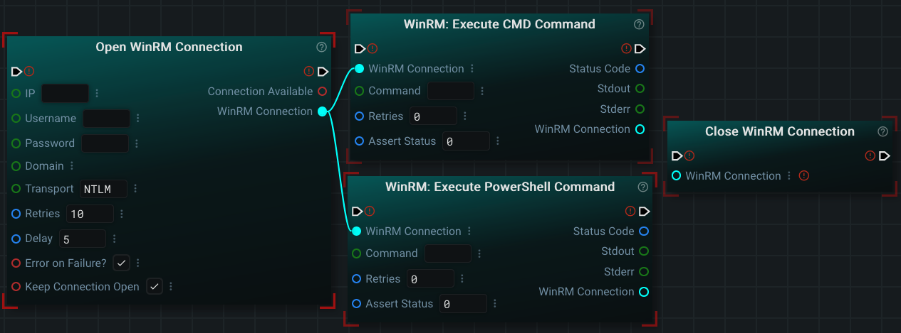
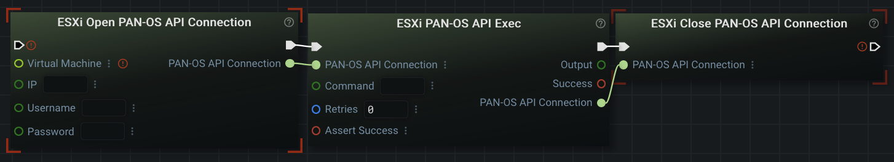
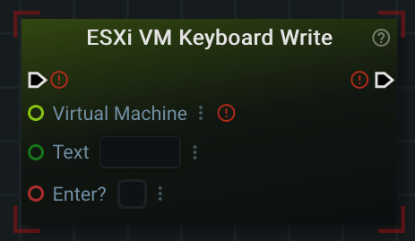
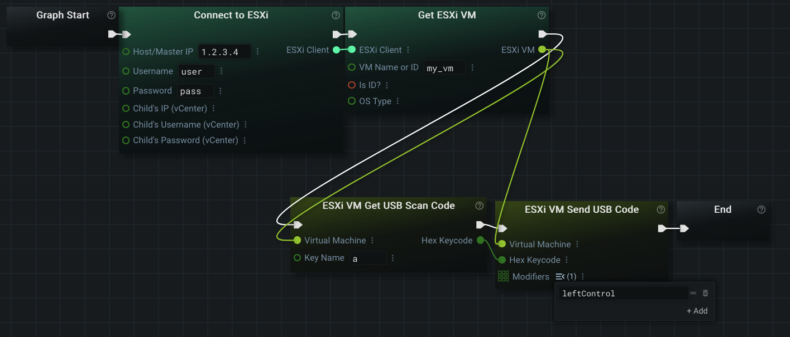

©2025 The MITRE Corporation. ALL RIGHTS RESERVED.
 
The author's affiliation with The MITRE Corporation is provided for identification purposes only, and is not intended to convey or imply MITRE's concurrence with, or support for, the positions, opinions, or viewpoints expressed by the author.'©2025 The MITRE Corporation. ALL RIGHTS RESERVED.
NOTICE
 
This software was produced for the U. S. Government under Basic Contract No. W56KGU-18-D-0004, and is subject to the Rights in Noncommercial Computer Software and Noncommercial Computer Software Documentation Clause 252.227-7014 (FEB 2014)

# Introduction 
This repo contains the source code for the pip package graphex-esxi-utils. This package is a plugin for the the [GraphEx application](https://github.com/mitre/GraphEx).

# Installation
This plugin can be installed via pip:
```
python3 -m pip install graphex_esxi_utils
```

This plugin can also be installed from source via: 'make all'.

# Execution
The code in this repo is not meant to be executed directly. It is an interface between the python library 'esxi_utils' and the
'graphex' python module. Any code here is meant to be loaded via the 'graphex' application.

# Plugin Documentation

For documentation on this plugin, please read the offical documentation in [the markdown documentation directory](graphex_esxi_utils/docs/markdown/index.md).
<br />

This documentation can also be reached from inside the Graphex UI itself by navigating to 'Help' -> 'Documentation (Tutorial)' on the menu bar.
<br />

# Quick Tour

This plugin has hundreds of nodes preprogrammed for you to interact with ESXi, SSH, WinRM, and individual VMs.

For example, here is a graph that will connect to a ESXi host, retrieve a VM called "my_vm" from ESXi, power it off, wait for the vm to fully power off, and then export the VM to an OVF file on the computer running the graph:
<br />


<br />

Here is an example of opening a (generic) SSH connection:
<br />


<br />

You can also specify 'Unix' and 'Cisco' SSH connection subtypes to get access to nodes that know specifically how to interact with those shell types (e.g. ls via bash on a Unix SSH Connection)
<br />

Here is an example of opening a WinRM connection to a Windows server (you can use either powershell or cmd):
<br />


<br />

Here is an example of opening a connection over the PANOS (Palo Alto) API:
<br />


<br />

Finally, here are some examples of sending keyboard input to a VM that already exists. Writing keyboard input to the VM:
<br />


<br />

Sending a single key with a specific modifier:
<br />


<br />

Once again, you can read more about some of the functionality included by this plugin in [the markdown documentation directory](graphex_esxi_utils/docs/markdown/index.md).
